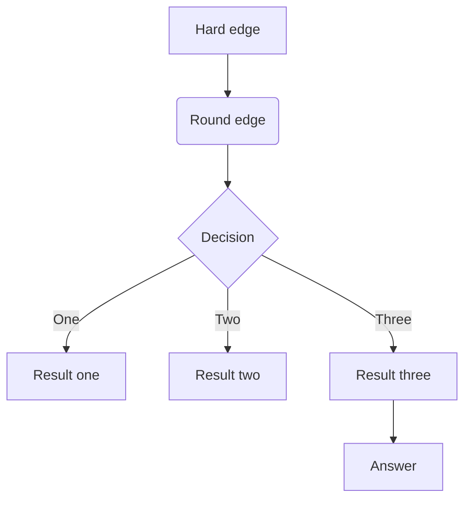
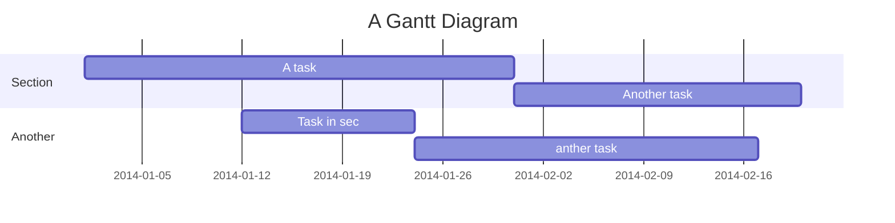
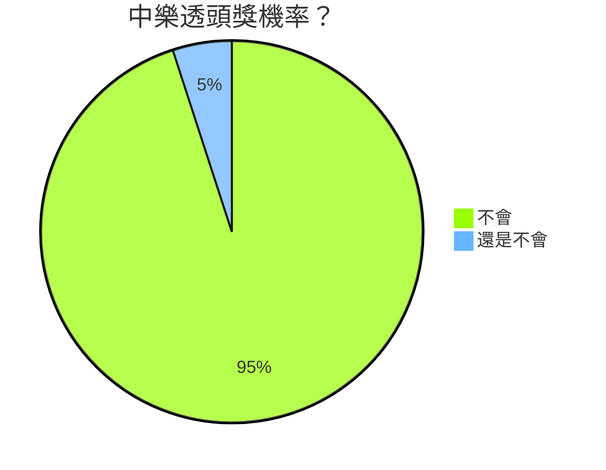

## 1. 標題

標題使用 `#` 來表示，`#` 的數量決定了標題的層級。例如：

```markdown
# 這是 H1 標題
## 這是 H2 標題
### 這是 H3 標題
```

---

## 2. 列表

有序列表和無序列表是 Markdown 中常用的格式：

- 無序列表使用 `-`、`*` 或 `+` 來表示。
- 有序列表使用數字加點 `1.`、`2.` 來表示。

### 無序列表範例

- 第一項
* 第二項
+ 第三項

### 有序列表範例

1. 第一項
2. 第二項
3. 第三項

---

## 3. 文字格式

你可以使用簡單的語法來讓文字加粗、斜體或添加刪除線。

- **加粗**：`**文字**` 或 `__文字__`
- _斜體_：`*文字*` 或 `_文字_`
- ~~刪除線~~：`~~文字~~`

這是 **加粗** 的文字。
這是 *斜體* 的文字。
這是 ~~刪除線~~ 的文字。

---

## 4. 連結與圖片

連結和圖片的語法類似，不過連結使用方括號加上括號，圖片則在前面加上 `!`。

### 連結範例

[Google](https://www.google.com)

### 圖片範例


(此功能為點擊圖片後會有放大效果，目前連結失效，可能是需要有效的網路圖片連結)

---

## 5. 程式碼

Markdown 支援行內代碼和多行代碼區塊：

- 行內代碼使用反引號（`` ` ``）來表示。
- 多行代碼區塊使用三個反引號（```）來表示，並可以指定程式語言。

### 行內代碼範例

```markdown
這是一段行內代碼：`print("Hello, World!")`
```

### 多行代碼區塊範例

```python
# 這是一段 Python 程式碼
def hello_world():
    print("Hello, World!")
```

---

## 6. 區塊引用

區塊引用使用 `>` 符號來表示，可以用於引言或強調某些內容。

> 這是一段區塊引用，可以用來強調重要的資訊。

## 7. 分隔線

分隔線可以使用三個或更多的 `-`、`*` 或 `_` 來創建，這通常用於分隔不同的章節或段落。

---
## 8. 表格

你可以使用簡單的管道符號（`|`）來創建表格：

| 名字    | 年齡  | 職業  |
| ----- | --- | --- |
| Alice | 25  | 工程師 |
| Bob   | 30  | 設計師 |
|       |     |     |

---

## 9. html語法
以下情境可使用html語法：
* `&emsp;`：代表一個空白
* `<br/>`：換行

---

## 10. 流程圖


[更多關於 **流程圖** 語法](http://adrai.github.io/flowchart.js/)

---

### 11.數學表達式

您可以使用 **MathJax** 語法 來產生 *LaTeX* 數學表達式，如同 [math.stackexchange.com](http://math.stackexchange.com/)，但是開始的 `$` 後面以及結尾的 `$` 前面不能有空白：

The *Gamma function* satisfying $\Gamma(n) = (n-1)!\quad\forall n\in\mathbb N$ is via the Euler integral

使用區塊層級的數學式時，請在您的數學式之前與之後給予 `$$` 以及換行：

$$
x = {-b \pm \sqrt{b^2-4ac} \over 2a}.
$$

$$
\Gamma(z) = \int_0^\infty t^{z-1}e^{-t}dt\,.
$$

[更多關於 **LaTeX** 數學表達式](http://meta.math.stackexchange.com/questions/5020/mathjax-basic-tutorial-and-quick-reference)

---

### 12各式圖表(Mermaid)

1. 進度圖


2. 圓餅圖


[更多關於 **mermaid** 語法](http://mermaid-js.github.io/mermaid)


